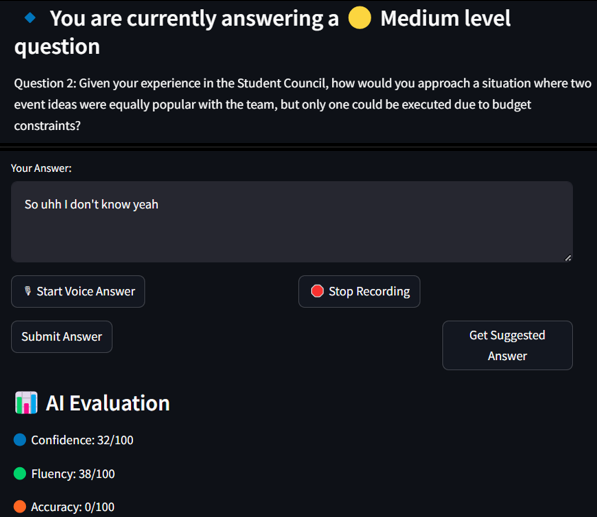

# AI-Interviewer

## Summary
This project presents an **AI-powered** interview preparation app designed to help students and professionals practice job interviews in a realistic and personalized manner. Using the **Google Gemini API**, the app analyzes resumes to tailor domain-specific questions. It evaluates responses with **BERT** for semantic accuracy and grammar, and employs **Reinforcement Learning** to adjust question difficulty dynamically. Additional features include speech-to-text transcription, suggested answers, and detailed feedback. The app aims to improve communication skills and boost interview readiness, though it currently lacks non-verbal analysis and real-time coaching, which are part of the proposed future enhancements.

## Contributor List
1. Shorya Mehra
2.

## Snapshot

  

